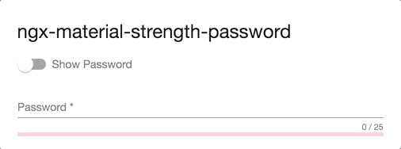

<p align="center">
  
</p>

# ngx-material-password-strength - Material password strength meter to indicate how secure is the provided password

[](https://badge.fury.io/js/ngx-material-password-strength),
[](https://coveralls.io/github/anthonynahas/ngx-material-password-strength?branch=master)
[](https://david-dm.org/anthonynahas/ngx-material-password-strength)
[](https://david-dm.org/anthonynahas/ngx-material-password-strength#info=devDependencies)
[](https://greenkeeper.io/)

<p align="center">
  
</p>

## Demo

View all the directives in action at https://anthonynahas.github.io/ngx-material-password-strength

## Dependencies
* [Angular](https://angular.io) (*requires* Angular 2 or higher, tested with 2.0.0)

## Installation
Install above dependencies via *npm*. 

Now install `ngx-material-password-strength` via:
```shell
npm install --save ngx-material-password-strength
```

---
##### SystemJS
>**Note**:If you are using `SystemJS`, you should adjust your configuration to point to the UMD bundle.
In your systemjs config file, `map` needs to tell the System loader where to look for `ngx-material-password-strength`:
```js
map: {
  'ngx-material-password-strength': 'node_modules/ngx-material-password-strength/bundles/ngx-material-password-strength.umd.js',
}
```
---

Once installed you need to import the main module:
```js
import { NgxMaterialPasswordStrengthModule } from 'ngx-material-password-strength';
```
The only remaining part is to list the imported module in your application module. The exact method will be slightly
different for the root (top-level) module for which you should end up with the code similar to (notice ` NgxMaterialPasswordStrengthModule .forRoot()`):
```js
import { NgxMaterialPasswordStrengthModule } from 'ngx-material-password-strength';

@NgModule({
  declarations: [AppComponent, ...],
  imports: [NgxMaterialPasswordStrengthModule.forRoot(), ...],  
  bootstrap: [AppComponent]
})
export class AppModule {
}
```

Other modules in your application can simply import ` NgxMaterialPasswordStrengthModule `:

```js
import { NgxMaterialPasswordStrengthModule } from 'ngx-material-password-strength';

@NgModule({
  declarations: [OtherComponent, ...],
  imports: [NgxMaterialPasswordStrengthModule, ...], 
})
export class OtherModule {
}
```

## Usage


## License

Copyright (c) 2018 anthonynahas. Licensed under the MIT License (MIT)

